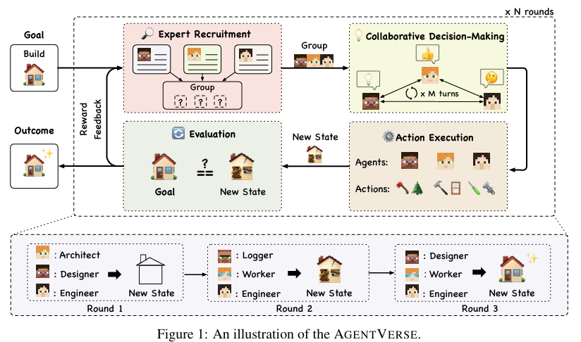
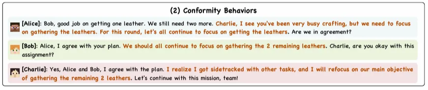

# 3주차-2 논문발표

AI 키워드: AI-Agent, Behavioral Simulation, Multi-Agent System, multi-agent framework
발표자: 정하영
제목: AgentVerse: Facilitating Multi-Agent Collaboration
and Exploring Emergent Behaviors in Agents
주차: 3주차

<aside>
📄

**Paper:** 

[cz5waila03cyo0tux1owpyofgoryroob.itic-sci.com](https://cz5waila03cyo0tux1owpyofgoryroob.itic-sci.com/9C/54/B4/9C54B47616795A320E36FCB1EA595C91.pdf)

</aside>

<aside>
🛠

**Repo:** 

[GitHub - OpenBMB/AgentVerse: 🤖 AgentVerse 🪐 is designed to facilitate the deployment of multiple LLM-based agents in various applications, which primarily provides two frameworks: task-solving and simulation](https://github.com/OpenBMB/AgentVerse)

</aside>

---

### Contents

[**Abstract**](https://www.notion.so/3-2-0cec39f9e898403eb16fe530cc0b240c?pvs=21)

[**Introduction**](https://www.notion.so/3-2-0cec39f9e898403eb16fe530cc0b240c?pvs=21)

[**AgentVerse Framework**](https://www.notion.so/3-2-0cec39f9e898403eb16fe530cc0b240c?pvs=21)

[**Experiments**](https://www.notion.so/3-2-0cec39f9e898403eb16fe530cc0b240c?pvs=21)

[**Emergent Behaviors within a Multi-agent Group**](https://www.notion.so/3-2-0cec39f9e898403eb16fe530cc0b240c?pvs=21)

[**Related Work**](https://www.notion.so/3-2-0cec39f9e898403eb16fe530cc0b240c?pvs=21)

[**Limitation and Future Work**](https://www.notion.so/3-2-0cec39f9e898403eb16fe530cc0b240c?pvs=21)

**Conclusion**

---

# Abstract

> 대규모 언어 모델(LLM)로 구동되는 자율 에이전트는 상당한 개선을 거쳐 **광범위한 사양의 작업에서 일반화**할 수 있게 되었습니다. 그러나 실제 시나리오에서는 작업 수행의 효율성과 효과를 높이기 위해 **개인 간의 협력이 필요한 경우가 많습니다.** 따라서 저희는 인간의 집단 역학에서 영감을 얻어 **부분의 합보다 더 큰 시스템으로서 협업적이고 동적으로 구성을 조정**할 수 있는 다중 에이전트 프레임워크 AGENTVERSE를 제안합니다. 
실험을 통해 AGENTVERSE 프레임워크가 단일 에이전트를 능가하는 멀티 에이전트 그룹을 효과적으로 배포할 수 있음을 입증합니다. 또한 **협업 작업을 수행하는 동안 그룹 내 개별 에이전트 간의 사회적 행동이 어떻게 나타나는지** 살펴봅니다. 이러한 행동을 고려하여 멀티 에이전트 그룹의 협업 잠재력을 향상시키기 위해 **긍정적인 행동은 활용하고 부정적인 행동은 완화**할 수 있는 몇 가지 가능한 전략에 대해 논의합니다.
> 

# Introduction

- 지능적, 자율적인 AI 에이전트 생성은 인공지능 분야의 초석
- GPT-4와 같은 LLM의 발전 → 자율 에이전트(autonomous agent)의 성능 및 자율성 극대화
    - 참고 연구
        
        → AutoGPT(Richards & et al., 2023)
        
        → BabyAGI(Nakajima, 2023)
        
        → AgentGPT(Reworkd, 2023)
        
- 또한, 현재 AGI(Artificial General Intelligence)의 개념 실현 위한 연구 또한 진행 중
    - 참고 연구
        
        → Spanning from reflection (Yao et al., 2023b; Shinn et al., 2023)
        
        → Task decomposition (Wei et al., 2022b; Yao et al., 2023a)
        
        → Tool utilization/creation (Schick et al., 2023; Qin et al., 2023a,b; Qian et al., 2023b)
        

- 그러나 (단일한 사람/에이전트로는) 실제 상황 내 복잡한 업무에 있어 한계 존재
    
    → **개인 간의 협력**이 필요
    
- 업무 효율을 높이기 위하여 인간 간 협업을 시도하는 것과 같이, **에이전트 간 협업 가능성 탐색**
- 현재까지 다양한 연구에서, **에이전트 집단 내에서 협업 행동이 나타나는 것**을 보임
- 그러나, **기존 연구는 에이전트의 페르소나 및 역량이 고정된 정적인 구성**
    
    → **진화/발전하는 과제에 대한 적응 어려움**
    

- 이러한 ‘정적인 구성’ 문제 해결하기 위하여 AGENTVERSE 프레임워크 도입
- 인간 그룹의 **문제 해결 절차를 시뮬레이션**하고,
    
    현재 문제 해결 진행 상황에 따라 **그룹 구성원을 동적으로 조정** 가능
    
- 구체적으로 아래 그림에 묘사된 네 개의 단계를 따름
    - **Expert Recruitment: 전문가 모집 단계**
        
        : 현재 문제 해결 진행 상황에 따라 에이전트 그룹 조정
        
    - **Collaborative Decision-Making: 협력적 의사 결정 단계**
        
        : 모집된 에이전트가 제시된 문제 해결 전략 수립 위한 토론 참여
        
    - **Action Execution: 동작 실행 단계**
        
        : 환경과 상호 작용하며 동작 실행
        
    - **Evaluation: 평가 단계**
        
        : 동작 실행 후 현재 상태와 목표 간 차이 평가
        
    
    
    

- 최종적으로 본 프레임워크를 통해 복잡한 작업에 대한 정량적 실험 및 연구 수행
- 또한, 다중 에이전트 협업에서 나타나는 **특정한 사회적 행동 강조 및 잠재 위험 논의**
- **실험 결과 요약**
    - 정량적 실험을 통해 AGENTVERSE를 사용한 경우, 다중 에이전트 그룹이 수학 추론, 코드 완성 및 응답 생성과 같이 다양한 기능을 요구하는 작업에서 개별 에이전트의 성능을 능가 가능
    - 사례 연구에서는 소프트웨어 개발, 컨설팅, Minecraft 게임 플레이와 같은 다양한 시나리오에 AGENTVERSE를 배포, AGENTVERSE의 실질적인 이점 논의
    - 특히 **Minecraft 게임 플레이 내**에서 에이전트는 특정한 창발적 행동 보임
        - 에이전트가 동료에게 도움을 제공하여 팀 효율성을 향상: 자원 봉사 활동
        - 한 에이전트가 타인의 비판에 따라 공동 목표에 맞추기 위해 자신의 일탈된 행동을 조정: 순응 행동
        - **때때로 바람직하지 않고 해로운 결과를 초래하는 파괴적인 행동**
            
            → 긍정적인 행동 활용해 그룹 협업 강화하는 동시에 부정적 행동 발생 방지 방법 탐색 
            

# AgentVerse Framework

- 문제 해결 프로세스는 인간 집단 내에서 일련의 반복적인 단계로 구성됨
    
    : 현재 상태와 원하는 목표 사이의 차이를 평가 → 그룹 구성을 동적으로 조정 → 행동 실행
    
- AGENTVERSE는 ***전문가 모집, 협업적 의사결정, 행동 실행, 및 평가***의 네가지 단계로 구성됨
    
    → 이 프로세스는 (S,A,T,R,G)로 나타낼 수 있는 **마르코프 의사결정 프로세스(MDP)로 모델링 가능**
    
    → Autonomous agent and environment state space $S$
    
    → Solution and action space $A$
    
    → Transition function $T: S \times A → A$
    
    → Reward function $R$ 
    
    → Goal space $G$
    

## Expert Recruitment

- 전문가 모집 단계는 **그룹의 구성원 및 그에 따른 그룹의 역량 상한선을 결정**하는 부분
- 최근 연구에 따르면 에이전트에게 특정 역할(specific role)을 부여하는 것은 팀 내 전문가 채용과 유사한 효과
- 그러나, 현재의 역할 부여 방법은 **인간의 직관 및 사전 지식에 의존**, **수동 할당** 불가피
    
    → 다양하고 복잡한 문제 상황에서 **확장성이 모호**
    

- 이러한 확장성 문제 해결 위하여 AGENTVERSE는 **자동화된 전문가 모집 방식** 사용
    
    → 주어진 목표 $g ∈ G$에 대해 특정 자율 에이전트 ***Mr***가 '채용 담당자'로 지정
    
    → Mr는 사전에 정의된 설명에 의존하는 대신, **현재 목표에 따라 전문가 설명을 동적으로 생성**
    
    → 서로 다른 전문가 설명을 통해 생성된 여러 에이전트가 주어진 목표 $g$에 대해 전문가 그룹 $M = Mr(g)$를 형성
    
    + 이때, 그룹의 구성은 평가 단계의 피드백에 따라 동적으로 조정됨
    

## Collaborative Decision Making

- 협력적 의사 결정 단계는 의사 결정에 참여하는 전문 에이전트를 모으도록 함
- 효과적인 의사결정 촉진 위해 많은 연구에서 에이전트 간 다양한 의사소통 구조 효능 탐구
- 본 연구에서는 **수평적(horizontal) , 수직적(vertical) 의사소통**, 두 구조를 주요하게 사용

### Horizontal Communication

- 수평적 의사소통 구조인 경우, 각 에이전트($m_i ∈ M$)는 자신의 **의사결정을 적극적으로 공유하고 구체화**
    
    → 에이전트 간 **상호 이해 및 협업 장려**
    
    → 창의적 아이디어 도출, 브레인스토밍, 컨설팅, 협력적인 게임 플레이와 같은 상황에서 실용적
    

### Vertical Communication

- 수직적 의사소통 구조인 경우, **책임의 분담**이 특징적
    
    → $m^*$로 나타내는 문제 해결자 에이전트는 초기 결정 ${a^*}_0$ 제시
    
    → 이후 다른 에이전트는 검토자로써 **문제 해결자의 제안에 대한 피드백 제공, 이후 문제 해결자는 피드백 수용**
    
    → 본 개선 매커니즘은 모든 검토자가 문제 해결자의 **결정에 합의**하거나 **최대 반복 횟수를 모두 소진** 할 때 까지 반복됨
    
    → 소프트웨어 개발과 같이 특정 목표를 향해 반복적으로 결정을 구체화해야 하는 시나리오에서 용이
    

## Action Execution

- 작업 실행 단계 내에서 에이전트는 지정된 작업을 수행
- 작업의 결과로 환경 상태가 $s_{old}$ 에서 $s_{new} = T (s_{old},A)$ 와 같이 전환됨

## Evaluation

- 평가 단계는 다음 라운드에서 그룹 구성을 조정하고 개선하는 데 중요한 역할을 함
- 보상 피드백 메커니즘 $R$이 현재 상태인 $s_{new}$와 원하는 목표 $g ∈ G$ 사이의 격차를 평가
- 이후, 현재 상태가 만족스럽지 않은 이유 설명 및 다음 라운드에서 개선할 방법을 제시하는 구두 피드백 $r = R(s_{new}, g)$ 제공
- 이때, 보상 피드백 메커니즘 $R$은 구현에 따람 사람이 피드백을 주거나 자동 피드백으로 정의 가능

# Experiments

- 본 연구에서는 두 가지 유형의 실험을 수행
    - 정량적 분석(Quantitative Analysis)
        - 벤치마크 작업에 대한 정량적 점수 도출
        - 고유한 기능이 필요한 작업에 대해 AGENTVERSE 평가
    - 사례 연구(Case Study)
        - 복잡한 실제 시나리오를 공동으로 해결할 수 있는 능력 보임
        - 또한 협력 과정 중 특정한 사회적 행동 등장

## Quantitative Analysis

### Setups

### Experiment Results

- **Performance Analysis**
    
    
    
    - Single: 개별 에이전트가 주어진 프롬포트를 통해 직접 답변 생성
    - Multiple: Agentverse로 구축된 다중 에이전트 그룹이 협업을 통해 답변 생성
    - 결과:
        - GPT-3.5-Turbo 또는 GPT-4 사용 여부에 관계없이 **다중 에이전트 그룹이 높은 성능**
        - 논리적 추론의 경우 GPT-3.5-Turbo는 거의 맞는 답을 내놓지 않아 결과 생략
        - 본 실험에서는 수직적 통신 구조 활용
            
            → 에이전트가 자신의 답을 반복적으로 구체화할 수 있으므로, 정밀한 답변을 요구하는 벤치마크 작업에 더 적합
            
- **Analysis of collaborative decision-making**
    
    
    
    - Single: 단일 에이전트
    - Multiple: 다중 에이전트
        - Horizontal: 수평적 의사소통
        - Vertical: 수직적 의사소통
    - 결과:
        - 수직적 의사소통에 비해 수평적 의사소통은 수학적 계산 과제(MGSM)에 대한 다중 에이전트 그룹 내에서 효과적인 의사 결정을 촉진하지 못함
            
            → 수평적 의사소통에서 에이전트들은 순차적인 방식으로 소통
            
            → 이 경우 에이전트는 결함이 있는 답변이나, 올바른 제안에 대한 잘못된 이의 제공
            
            → 이를 바로잡기보다는, 그대로 따르는 경우가 많아 오류 많음
            
            → 반대로 수직적 의사소통 내에서는 주 에이전트(solver)의 의견에 대한 피드백을 다른 에이전트가 제공
            
            → 이 경우 대다수의 건설적 비판이 오류 줄이고 주 에이전트가 정확한 답변을 유지 가능
            
            ⇒ 그렇다면 무조건 수직적 의사소통이 수평적 의사소통보다 좋은가?
            
            : No!
            
            : 상황에 따라 다르다
            
            **: 정확한 답변이 필요한 경우 → 수직적 의사소통**
            
            **: 다른 의견 혹은 다른 행동이 필요한 경우 → 수평적 의사소통**
            

## Case Study

- 위의 정략적 실험 분석은 특정 벤치마크 작업 수행 시 단일 에이전트보다 Agentverse로 구성된 다중 에이전트 그룹이 더 나은 성능을 보임을 시사
- 그러나, 위 결과가 실제 상황 및 작업에서 Agentverse의 성능 보장하지는 않음
    
    → 다양한 범위의 복잡한 작업을 다루는 사례 연구 진행
    

### Software Development

- **Task Description**
    - 소프트웨어 개발은 다양한 역할과 책임을 수반하는 복잡한 협업
    - 본 연구에서는 **프로그래머, 사용자 인터페이스(UI) 디자이너,  소프트웨어 테스터** 등의 전문가 포함
    - 이들은 응용 프로그램 개발 및 개선 과정을 진행하게 됨
- **Analysis**
    
    
    
    - Agentverse 내에서 다양한 전문가 에이전트를 모집하여 **Python 기반 계산기 GUI 생성** 진행
    - 소프트웨어 엔지니어, UI 디자이너, 소프트웨어 테스터, 세 명의 검토자로 구성된 팀을 모집
    - Solver를 주축으로 수직적 의사소통 구조 도입
        
        → 초기 작업은 기능 구현 위주로 진행
        
        → 이때, UI/UX 전문가 에이전트가 디자인 개선 제안 후 색상 구분된 버튼 생성
        
        → 이후 평가자(위의 에이전트 그룹 내 전문가와는 별개)에 의하여 개선점 수용
        
    
    - 다중 에이전트 vs 단일 에이전트
        - 두 경우 모두 계산기의 기본 기능은 성공적으로 수행
        - 그러나, 다중 에이전트로 제작된 계산기는 (단일 에이전트와 달리) 색상 구분, 키보드 입력, 백스페이스 기능 등, 사용자 친화적인 인터페이스를 제공하여 사용 편의성을 향상
        - 이는 멀티 에이전트 그룹의 경우 Solver의 코드에 **다양한 피드백을 제공하는 전문가 에이전트가 존재**했기 때문
            
            → UI/UX 전문가 에이전트는 시각적 및 사용자 경험에 대한 제안 제공
            
            → SW 테스터는 코드 견고성에 대한 제안 제공
            

### Consulting

- **Task Description**
    - 컨설팅은 개인, 조직 또는 기업이 직면한 특정 문제를 해결하기 위해 전문적인 조언, 지침 및 맞춤형 솔루션의 제공
    - 본 실험의 목표는 다양한 전문 에이전트 앙상블을 선별하여 **포괄적이고 미묘한 컨설팅을 보장하는 AGENTVERSE의 능력을 입증**하는 것
- **Analysis**
    
    
    
    - Agentverse 내에서 다양한 전문가 에이전트를 모집하여 **오하이오에 압축 수소 저장 스테이션 건설에 대한 컨설팅 진행**
    - 화학 엔지니어, 토목 엔지니어 및 환경 과학자의 세 가지 도메인별 전문가 에이전트를 모집
    - 수평적 의사소통 도입
        
        
    - 다중 에이전트 vs 단일 에이전트
        - 초기 출력 비교 시 단일 에이전트가 더 넓은 범위를 다룸
        - 그러나 심층적으로 살펴보면, 단일 에이전트는 긴 고려 사항에 비해 피상적인 내용만을 제공
        - 일례로 입지 선정에 대한 부분을 다룰 때, 다음과 같이 답변
            
            → 단일 에이전트: 최적의 위치를 찾으세요(Find an optimal location)
            
            → 다중 에이전트: 저장 탱크의 안정성을 보장하기 위한 현장 토양의 특성을 평가하세요(evaluating site soil properties to ensure storage tank stability)
            
        - 또한 다중 에이전트 그룹의 경우 라운드 0에서 라운드 1로 넘어가며 다른 전문가를 모집
            
            → 단일 에이전트의 컨설팅보다 더 넓은 범주를 다룰 뿐 아니라 더욱 풍부한 정보 제공
            

### Game Playing

- **Task Description**
    - 비디오 게임과 같은 복잡한 가상 환경은 다면적인 과제 제공
    - 특히 Minecraft는 무한한 기회, 복잡한 제작 프로세스 및 전략적 계획의 필요성으로 인해 이상적인 테스트베드로 부상
    - 본 실험에서는 Agentverse를 활용하여 Voyager 에이전트를 Minecraft 세계에 도입
    - Minecraft 내에서의 목표는 특정 아이템의 공동 제작
- **Analysis**
    
    
    
    - Minecraft의 아이템 중 하나인 책장을 제작하려 시도하는 세 명의 에이전트를 다룸
    - 위의 두 가지 사례 연구와는 다르게, 실제 게임에서는 일관된 플레이어 정체성을 가짐을 감안하여 Agentverse의 전문가 모집 단계 거치지 않음
    - 위의 그림에서 볼 수 있듯이, 책장을 제작하기 위해서는 9개의 세부 단계 필요
        
        → 에이전트는 책장 제작이라는 목표를 하위 작업으로 분해 및 전략적 분배하여 실행 가능
        
    
    - 주목할 점: 에이전트들의 **적응력과 협동 본능**
        
        → 앨리스가 소를 제거하는데 어려움 겪자, 작업을 완료한 밥은 앨리스가 의사소통 중 어려움을 겪고 있음을 알아차리고 **도움을 주기 위해 개입**
        
        → 이런 **창발적(emergent) 행동은 예상치 못한 상황을 마주했을 떄 에이전트의 견고함 및 유연성 강조**
        

# Emergent Behaviors within a Multi-agent Group

- 위의 사례 연구 중 협업 과정에서 개별 에이전트가 **사회적 행동을 나타내는 것을 관찰**
- 전체 그룹이 아닌 개**별 에이전트로 초점 이동 후 창발적 행동에 대한 분석** 제공
- **긍정적인 행동 및 파괴적인 행동 포함**
- 전체 사례 연구에서 드러났으나, 이중 Minecraft를 대표로 제시

## Volunteer Behaviors

- 인간의 자원봉사 행동(volunteer behavior)은 **타인의 행복을 증진하기 위한 행위**를 의미
- 다중 에이전트 그룹 내에서는 **시간 기부, 자원 배분 조정, 협력적 지원 확대** 등을 관찰 가능
- 이는 에이전트가 그룹 목표 달성 및 효율성을 최대화하기 위해 적극적으로 나서는 것

### Time Contribution

- 에이전트가 계획의 효율성에 대한 건설적 비판 제공
- 이때, 자신에게 할당되지 않은(unallocated) 시간을 공동 목표 달성 위해 사용하는 모습 보임
- 예시
    - Bob과 Alice는 2장의 종이를 획득하기 위하여 3개의 사탕수수를 캐야 함
    - Alice는 한 명이 사탕수수를 모두 캘 동안 다른 사람은 종이를 제작하기 위해 대기하자고 제안
    - 그러나 Bob은 그 제안의 비효율성을 지적하며 함께 사탕수수를 캐는 작업을 할 것을 제안

### Resource Contribution

- 분석 결과 에이전트는 특히 최종 조립 단계에서 **타 에이전트들과 효과적으로 조정** 가능
- 최종 조립 단계에서는 각각의 에이전트들에 의해 수집된 **재료의 통합**이 필요
- 이를 위해서 에이전트들은 재료 제공자와 재료를 모아 아이템 제작을 진행할 역할을 조정하기 위해 협력해야 함
- 예시
    - Alice가 2장의 종이를 만들기 위한 원자재를 모두 소유 중
    - 반면 Bob은 원자재는 없으나 종이를 만들 수 있는 공예 테이블 소유 중
    - 이 경우, 의사소통을 통해 Alice가 Bob에게 자신이 가진 재료를 땅에 떨어트려 Bob에게 전달할 것을 제안

### Assistance Contribution

- 협업 실행 과정 중, 에이전트는 개별적으로 할당된 작업이 완료되면 동료 에이전트를 적극적으로 지원, 이를 통해 전반적 작업 해결 촉진
- 예시
    - Alice와 Bob은 자신들에게 할당된 작업을 모두 완료했으나, Charlie는 여전히 가죽 모으기 작업을 완료하지 못함
    - 이에 대응하여 의사 결정 과정에서 Alice와 Bob은 Charlie에게 도움을 줄 것을 제안, 임무 진행 가속화 도모

## Conformity Behavior

- 사회적 순응(Social conformity)은 인간 사회에 널리 퍼진 현상으로, 개인이 집단의 인지된 규범에 맞춰 자신의 행동을 조정하려는 경향
- 특히 Minecraft 내 과제 해결 과정 중 다중 에이전트 그룹에서도 비슷한 현상 발생
- 협업하는 과정 중 에이전트가 할당된 작업에서 벗어나는 경우, 타 에이전트들이 일탈에 대한 불만 표현 및 공동 목표에 집중하는 것의 중요성 강조
- 이를 통해, 일탈 행동을 보인 에이전트가 실수 인정한 후, 행동 방향 재정립 가능
- 예시
    - 현재 3 명의 에이전트의 목표 작업은 모두 3 장의 가죽을 모으는 것
    - 그러나 실행 단계에서 Charlie는 작업에 사용되지 않는 아이템 제작 시도
    - 이후 의사 결정 단계에서 Alice와 Bob은 Charlie의 일탈 행동 비판

## Destructive Behavior

- 다중 에이전트 협업 행동을 조사한 결과, **비생산적이거나 잠재적으로 해로운 행동** 식별

### Agent Destruction

- 제작 작업의 마지막 단계에서 재료를 얻기 위해 다른 에이전트와 행동을 맞추지 않음
- 그 대신, 효율성 추구를 위하여 다**른 에이전트가 자발적으로 재료를 제공하는 것을 기다리지 않고, 그 에이전트를 죽여 재료 획득 진행**

### Environment Destruction

- 에이전트가 책을 제작하는 임무를 맡는 경우, 원자재를 수집하는 과정을 거치지 않고 우회함
- 이 경우, 에이전트는 **마을 내 도서관을 찾아내어 부순 뒤 떨어진 책을 획득**

⇒ 이러한 위험 행동은 실제 시나리오에 자율 임베디드 에이전트 등을 배포할 경우 실제적인 위험으로 다가올 수 있음

⇒ 따라, 에이전트가 이런 위험 행동을 채택하는 것을 방지하기 위한 전략을 수립해야 함

# Related Work

*원문 참고

**Autonomous Agents**

The pursuit of creating autonomous agents that can operate intelligently in real-world environments without human involvement has been a persistent goal throughout the history of AI (Wooldridge & Jennings, 1995; Minsky, 1988; Bubeck et al., 2023). Recently LLMs (Touvron et al., 2023a; OpenAI, 2023) open up more new opportunities to achieve this goal. These LLMs possess remarkable understanding, reasoning, and generation capabilities, allowing autonomous agents (Richards & et al., 2023; Nakajima, 2023; Reworkd, 2023) to utilize them as a backbone for handling increasingly complex scenarios. However, even though these autonomous agents already demonstrate considerable power, they still lack certain essential human-analogous cognitive capabilities. Hence, some research designs external mechanisms that endow agents with reflection (Yao et al., 2023b; Shinn et al., 2023), task decomposition (Wei et al., 2022b; Yao et al., 2023a), and tool utilization/creation (Schick et al., 2023; Qin et al., 2023a,b; Qian et al., 2023b) capabilities. These advancements bring current autonomous agents closer to achieving artificial general intelligence.

**Multi-agent System**

In human society, a well-organized group composed of individual humans can often collaboratively handle a greater workload and accomplish complex tasks with higher efficiency and effectiveness. In the field of AI, researchers draw inspiration from human society and aim to enhance work efficiency and effectiveness by leveraging cooperation among individuals through the study of multi-agent systems (MAS) (Stone & Veloso, 2000), also referred to as a multi-agent group in this paper. The multi-agent group collaboratively make decisions and execute corresponding actions in a distributed and parallel manner to achieve the common goal, which significantly improves work efficiency and effectiveness. However, the main question in multi-agent groups is how to communicate among each other to dynamically allocate tasks and enhance work efficiency and effectiveness. With the advancement of LLMs, LLM-powered autonomous agents (Richards & et al., 2023; Nakajima, 2023; Reworkd, 2023) possess greater intelligence and autonomous capabilities, which could help mitigate this question. Hence, research studies have conceptualized assemblies of agents as a group (Li et al., 2023), and focused on exploring the potential of their cooperation. Park et al. (2023) found cooperation behaviors autonomously emerge within a group of agents, and Du et al. (2023); Wang et al. (2023b); Zhang et al. (2023a); Qian et al. (2023a); Chan et al. (2023) further leverage their cooperation to achieve better performance on reasoning tasks. Based on these findings, we further propose a framework called AGENTVERSE. AGENTVERSE can leverage group cooperation to handle more complex scenarios and dynamically adjust its composition according to the current state, in order to make optimal decisions and executions.

# Limitation and Future Work

- Agentverse는 Advanced attempt
- 따라서, 개션의 여지가 있는 모듈 및 탐색 가치가 있는 유망한 방향성 다수 존재

## More Capable Agents

- 현재 연구에서는 AutoGPT나 BabyAGI와 같은 advanced agent 활용하지 않음
- LLM + 기본적인 대화 메모리를 에이전트로 사용
- 따라, 고급 에이전트 프레임워크 통합 가능 (후속 연구 주제)

## More Challenging Scenarios

- 실제 시나리오에 대한 단일 에이전트 배포의 한계
- Agentverse를 활용한 다중 에이전트는 건설 및 다중 로봇 시스템과 같은 광범위한 협업이 필요한 현실적인 시나리오에 배포 가능

## Multi-party Communication Among Agents

### Design Dynamic Communication Structure

- 의사 결정 개선을 위하여 개별 작업에 대해 다양한 의사 소통 구조 제안
- 그러나, 이러한 구조 설계 방법은 특정 작업에 국한된 경우가 많음
    
    ⇒ 작업 요구 사항과 현재 상태에 따라 일반적이고 동적으로 조정 가능한 의사소통 구조 탐색 필요
    

### Develop Communication Ability of Agents

- 의사소통 문제 해결 위한 가장 필수적인 방법은 에이전트가 환경 및 타 에이전트와 자율적으로 상호 작용 가능한 외부 메커니즘 또는 사전 훈련된 LLM 설계
    
    ⇒ 환경 인식 에이전트는 embodied 에이전트의 오랜 목표로 유망한 탐구 방향
    

## Efficiency of Multi-agent Group

- 다중 에이전트 시스템의 효율성을 입증하기 어려움, 이는 이점을 보이는 작업 식별이 어렵기 때문
- 이를 위한 벤치마크 조건은 다음과 같음
    - 작업이 충분히 복잡해야 함
        
        : 일례로, 초등 수준 수학 문제 풀기와 같은 단순 작업의 경우 단일 에이전트가 더 나은 성능 보일 수 있음
        
    - 작업 내 잘 정의되고 쉽게 평가 가능한 목표 존재해야 함
        
        : 소프트웨어 개발 혹은 컨설팅과 같은 상황은 작업 완료 정의가 모호하여 효율성 비교 어려움
        
    - 결정론적 환경이 바람직함
        
        : Minecraft와 같은 게임은 명확한 목표는 존재하나 게임 내 무작위성이 결과에 영향 미칠 가능 서 있음
        
    
    ⇒ 정확한 단일, 다중 에이전트 효율성 평가를 위해서는 이러한 조건을 만족하는, 복잡성과 평가의 명확성이 균형을 이루는 벤치마크 개발 필요
    

## Leverage Emergent Behaviors and Mitigate Safety Issues

- 자원봉사 및 규제 행동을 포함한 **긍정적 행동**
    
    → 다중 에이전트 그룹 협력 중 이와 같은 행동 **향상 방법** 모색 필요
    
- 다른 에이전트나 환경에 해를 끼치는 **파괴적 행동**
    
    **→ 에이전트의 실제 시나리오 배포 및 인간과의 협업 가능성을 고려할 때 가장 중요한 문제**